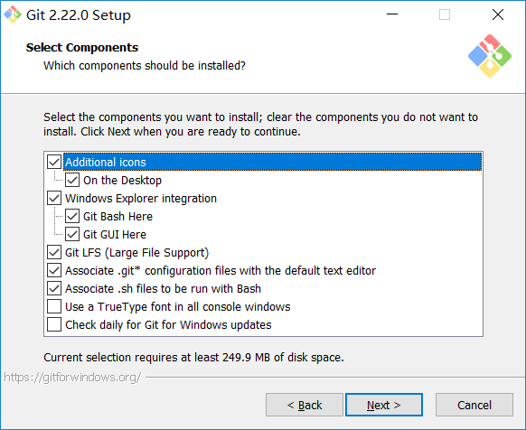
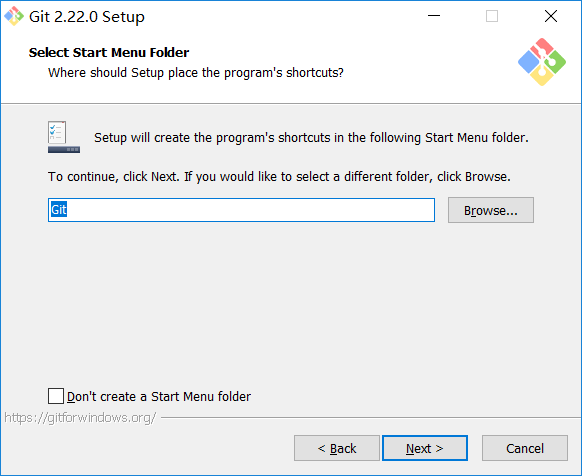

# Windows系统下安装Git

- 主要介绍windows系统下Git的安装与配置。

## Git安装

> - Git的安装非常简单，基本上 `next` 即可。
> - 本次安装Git版本：Git-2.22.0-64-bit。


> - 上图中可以自定义安装位置，如下图所示，然后点击 `Next` 。




> - - [x] **Additional icons On the Desktop** 添加桌面快捷方式。




> - 点击 **Intall** ，开始安装。


> - 安装完成，点击 **Finish** 即可。

---

## Git配置

### 1. 设置全局用户名和邮箱

```bash
git config --global user.name "your_name"
git config --global user.email "your_email@example.com"
```

> - `-- global` 为全局参数，表明本地所有Git仓库都会使用这个配置。


> - 上图，用户名设置为 **lizhengbo**，邮箱设置为 **lizhengbo@ebikj.com** 。
>
> - 上图，查看用户名和邮箱，使用以下命令：
>
> 	```bash
> 	git config user.name
> 	git config user.email
> 	```


> - 上图，查看已有的所有配置信息，可以使用 `git config --list` 命令。

### 2. 生成密钥(SSH key)

```bash
ssh-keygen -t rsa -P "" -C "your_email@example.com"
```

> - `-P` 表示密码；`-P ""` 表示空密码。
> - `-t rsa` 表示生成的密钥类型。


> - 上图，`Generating public/private rsa key pair.` 表示将使用提供的邮箱作为标签创建一个新的SSH密钥对。
> - 上图，`Enter file in which to save the key (/c/Users/lizhengbo/.ssh/id_rsa):` 输入要保存密钥的文件；按**回车键**即可，表示接受默认文件位置。
> - 上图，`/c/Users/lizhengbo/.ssh/id_rsa.pub` 表示密钥保存的路径。

### 3. 查看公钥

```bash
cat ~/.ssh/id_rsa.pub
```


### 4. 配置远程仓库

> - 以公司Git仓库为例：
>
>   1. 复制 **第3步** 中的公钥。
>
>   2. 将公钥添加到Git服务器的 **账户设置 > SSH 密钥** 中。


> - 上图，**密钥名称** 可以任意填写，不与已有名称重复即可。


> - 上图，**SSH 密钥** 添加成功。

### 5. 初始化本地仓库

> 1. 新建Git工作目录：如 `E:\git_workspace` 。
> 2. 进入 `git_workspace` 文件夹，**右键** 打开 `Git Bash` 。
> 3. 输入命令 `git init` 。


> - 上图，出现 `Initialized empty Git repository in E:/git_workspace/.git/` 表示初始化成功。

### 6. 克隆项目至本地仓库

```bash
git clone ssh://xxx@ip:port/*/*.git #项目SSH链接
```


> - 上图，选择 **SSH** 链接，点击 **复制链接** 按钮。


> - 上图，输入 `git clone` 命令，开始克隆项目。
> - 首次克隆项目，需要验证 **RSA key fingerprint**，输入 `yes` 即可。

