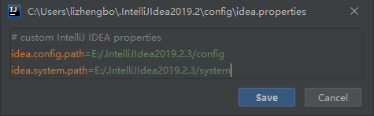
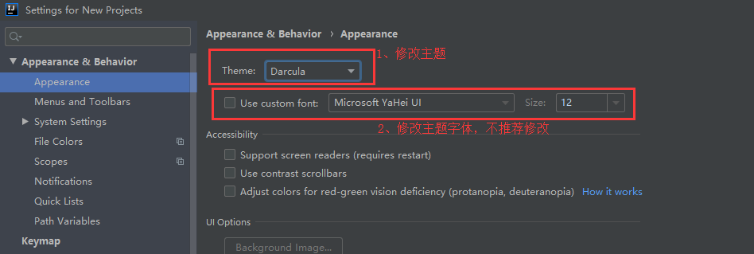
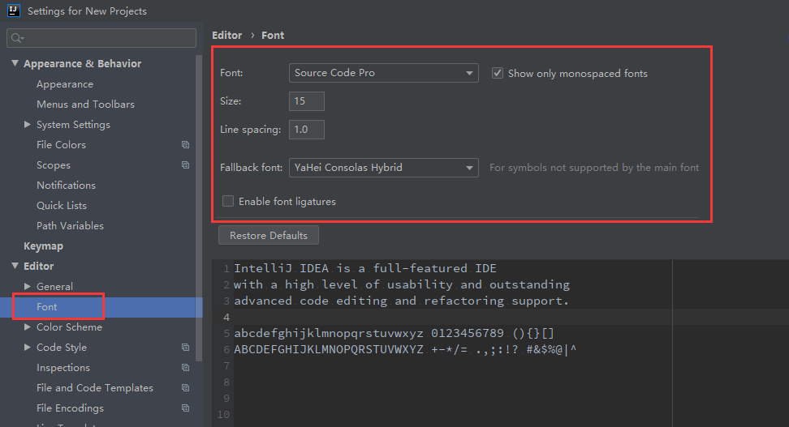
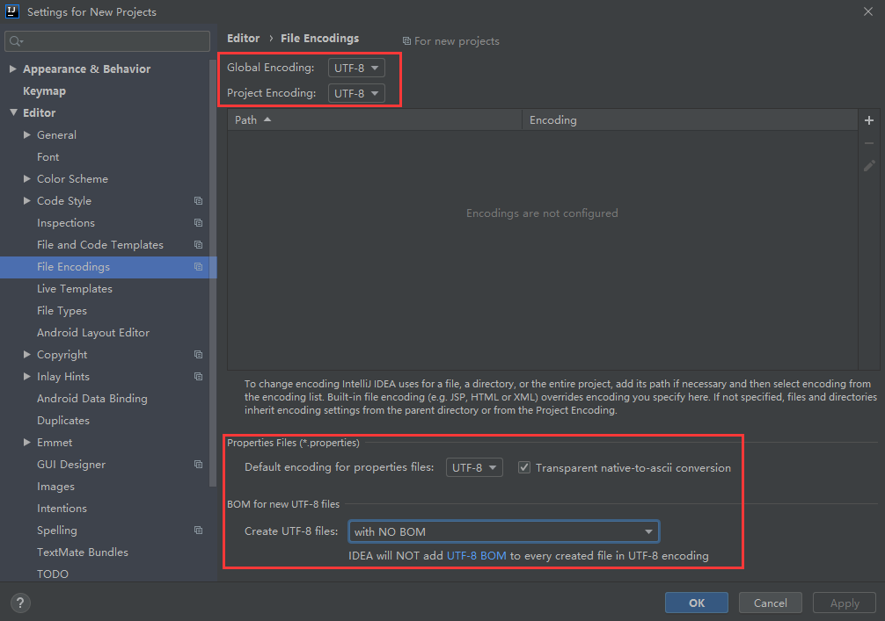

# IntelliJ IDEA 教程

本文主要总结 IDEA 使用的重要知识点。

## 一、配置文件目录

- 安装完成后，系统用户目录下的 `config` 和 `system` 目录可以全部删除，重新启动 IntelliJ IDEA 会自动再生成一个全新的默认配置

- **推荐使用 IDEA 菜单中的 Help -> Edit Custom VM Options 和 Help -> Edit Custom Properties 来进行参数个性化配置**

- 修改 `config` 和 `system` 目录位置

  ``` properties
  # 使用IDEA自带菜单中的 Help -> Edit Custom Properties 来进行个性化配置
  
  # 该属性主要用于指向 IntelliJ IDEA 的个性化配置目录
  # 多台机器使用相同个性化配置时，可以复制该目录内容
  idea.config.path=${user.home}/.IntelliJIdea/config
  # 该属性主要用于指向 IntelliJ IDEA 的系统文件目录
  # 随着项目的增多，system目录会很大，建议把该目录由C盘转移到其他盘符
  idea.system.path=${user.home}/.IntelliJIdea/system
  # 修改示例如下图
  ```




## 二、个性化配置

### 主题及主题字体



- 配置路径 `File | Settings | Appearance & Behavior | Appearance`
- 主题字体即为界面字体，不推荐修改；如果选择的字体不包含中文，那可能会在很多位置上出现类似 `口口口口口` 这样的乱码问题，比如文件名含有中文、字体是中文名字的都会变成 `口口口口口` 。

### 代码编辑区字体



- 配置路径 `File | Settings | Editor | Font`
- `Font` 第一字体
- `Show only monospaced fonts` 仅显示等宽字体，默认是勾选状态
- `Size` 字体大小
- `Line spacing` 行距
- `Fallback font` 备选字体，如果首选字体中无法显示文字，系统就会自动调用备选字体来显示。例如首选字体我们可以设置为英文字体，备选字体设置为中文字体，这样即可优美的显示代码，而中文也不会变为 `口口口口口`
- `Enable font ligatures` 是否启用字体连写，一般不启用

- 推荐字体下载地址

  > 链接：https://pan.baidu.com/s/1zcE202rJRMAl4LdtgCPtKw
  >
  > 提取码：tv4h 

### 文件编码



- 配置路径 `File | Settings | Editor | File Encodings`
- `Global Encoding` 全局编码，默认 `UTF-8`

- `Project Encoding` 项目编码，默认 `GBK` ，建议改为 `UTF-8`

- `Properties Files` 对 **Properties** 文件进行专门的编码设置，建议改为 `UTF-8`
  
- `Transparent native-to-ascii conversion` 自动转换ASCII编码，建议勾选，否则 **Properties** 文件中的中文显示为ASCII码
  
- `BOM for new UTF-8 files` 默认选择 **with NO BOM**，无须修改

  > BOM（byte-order mark），即字节顺序标记，它是插入到以UTF-8、UTF16或UTF-32编码Unicode文件开头的特殊标记，用来识别Unicode文件的编码类型。UTF-8 不需要 BOM。


## 三、操作

### 清除缓存和索引

[清除缓存和索引](https://github.com/judasn/IntelliJ-IDEA-Tutorial/blob/master/IntelliJ-IDEA-cache.md)

### 编译方式

[编译方式](https://github.com/judasn/IntelliJ-IDEA-Tutorial/blob/master/make-introduce.md)

## 四、其他教程

- [IntelliJ IDEA 简体中文专题教程](https://github.com/judasn/IntelliJ-IDEA-Tutorial)

