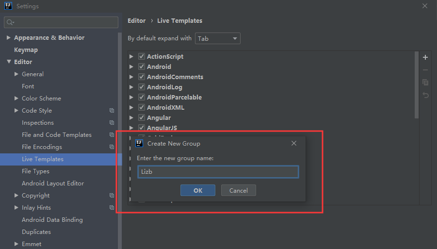
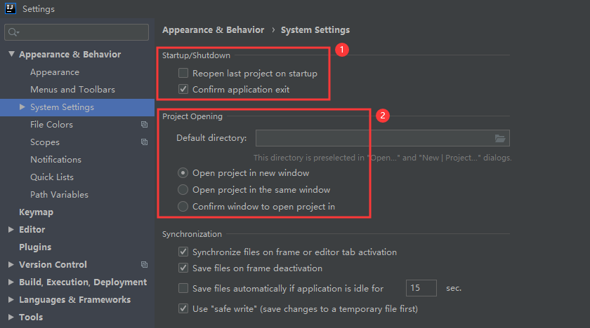

IntelliJ IDEA 教程

- 本文主要总结 IDEA 使用的重要知识点。
- 本文使用的 IDEA 版本为 **2019.2.4 Ultimate Edition** 。


## 安装

> 安装过程非常简单，基本上点击 `next` 即可。


- 默认安装位置为 **C盘**，可以自定义安装目录，如上图中的 `D:\Program Files\JetBrains\IntelliJ IDEA 2019.2.4`


- `Create Desktop Shortcut` 创建桌面快捷方式，建议勾选。
- `Update PATH variable (restart needed)` 更新环境变量，需要重启
  - `Add launchers dir to the PATH` 将 IDEA 启动目录添加到环境变量中，即可以从命令行中启动 IDEA，根据需要勾选。
- `Update context menu` 更新上下文菜单
  - `Add "Open Folder as Project"` 添加打开文件夹作为项目，即右键文件夹时多一个快捷选项 **快速把文件夹以 IDEA 的项目打开** ，根据需要勾选。
- `Create Associations` 创建文件关联，关联 `.java` 、 `.groovy` 、`.kt` 文件，即默认以 IntelliJ IDEA 打开这些格式的文件，由于 IntelliJ IDEA 打开速度缓慢，不建议勾选。建议在 Windows 系统上关联此类文件可以用 EmEditor、Notepad++ 这类轻量级文本编辑器。


- 安装完成，勾选 `run intellij IDEA` ，点击 `Finish` 运行 IDEA 。


## 首次运行


- 首次安装选择 `Do not import settings` ，即不导入任何配置。


- 选择主题


- 功能插件管理，首次使用建议直接点击 `Next: Featured plugins` 即可。


- 推荐插件列表，根据需要安装。


- 选择免费试用 30 天，点击 `Evaluate`，进入 IDEA 。


- `Create New Project` 创建一个新项目。
- `Import Project` 导入一个已有项目。
- `Open` 打开一个已有项目，可以直接打开 Eclipse 项目，但是由于两者 IDE 下的项目配置不一样，所以项目还是需要配置的。
- `Check out from Version Control` 可以通过服务器上的项目地址 Checkout Github 上面项目或是其他 Git 托管服务器上的项目。


## 核心文件和目录介绍

### 1. 安装目录介绍


- `idea.exe` 文件是 IntelliJ IDEA 32 位的可行执行文件。
- `idea.exe.vmoptions` 文件是 IntelliJ IDEA 32 位的可执行文件的 VM 配置文件。
- `idea64.exe` 文件是 IntelliJ IDEA 64 位的可行执行文件，要求必须电脑上装有 JDK 64 位版本。64 位的系统建议使用该文件。
- `idea64.exe.vmoptions` 文件是 IntelliJ IDEA 64 位的可执行文件的 VM 配置文件。
- `idea.properties` 文件是 IntelliJ IDEA 的一些属性配置文件，没有 32 位和 64 位之分。
- **强烈推荐不要直接修改安装目录下的这几个配置文件，因为 IDEA 升级/重装可能会导致修改完全失效！**
- **配置个性化参数时，强烈推荐在下列菜单中配置：**
  - `Help | Edit Custom Properties`
  - `Help | Edit Custom VM Options`

### 2. 配置目录介绍


- 在三大主流的操作系统上该文件夹都在当前用户的 Home 目录，Windows 上即 `%userprofile%`，Linux 和 Mac 上即 `~` 。
- 对于这个设置目录有一个特性，就是你删除掉整个目录之后，重新启动 IntelliJ IDEA 会再自动帮你再生成一个全新的默认配置，所以很多时候如果你把 IntelliJ IDEA 配置改坏了，没关系，删掉该目录，一切都会还原到默认。

- `config` 目录是 IntelliJ IDEA 个性化化配置目录，或者说是整个 IDE 设置目录。安装新版本的 IntelliJ IDEA 会自动扫描硬盘上的旧配置目录，指的就是该目录。这个目录主要记录了：IDE 主要配置功能、自定义的代码模板、自定义的文件模板、自定义的快捷键、Project 的 tasks 记录等等个性化的设置。若有多台机器使用相同个性化配置时，可以复制该目录内容。
- `system` 目录是 IntelliJ IDEA 系统文件目录，是 IntelliJ IDEA 与开发项目一个桥梁目录，里面主要有：缓存、索引、容器文件输出等等。随着项目的增多，system 目录会很大，建议把该目录由C盘转移到其他盘符。


### 3. 自定义配置目录

- 修改 `config` 和 `system` 目录位置

  ``` properties
  # 建议首次打开 IDEA 时，就修改 config 和 system 目录位置
  # 在主界面 Configure | Edit Custom Properties 中进行修改
  
  # 该属性主要用于指向 IntelliJ IDEA 的个性化配置目录，注意使用正斜杠
  idea.config.path=${user.home}/.IntelliJIdea/config
  # 该属性主要用于指向 IntelliJ IDEA 的系统文件目录，注意使用正斜杠
  idea.system.path=${user.home}/.IntelliJIdea/system
  
  # 修改示例如下图
  ```


- 点击右下角 `Configure` 选项。


- 选择 `Edit Custom Properties`


- 如上图所示，编辑 `idea.properties` 文件，添加以下内容：

  ``` properties
  idea.config.path=E:/.IdeaIC2019.2.4/config
  idea.system.path=E:/.IdeaIC2019.2.4/system
  ```

- 添加完成后，点击 `Save` 按钮，然后重启 IDEA 。


- 如上图所示，重启 IDEA 后，选择 `Do not import settings` ，然后重新设置 `首次运行` 即可。


## 激活

> 建议先修改配置目录后再进行激活，避免重复操作。


- 如上2图所示，在主界面，选择 `Configure | Edit Custom VM Options` 。


- 如上图所示，编辑 `idea64.exe.vmoptions` 文件，在末尾添加 `-javaagent:D:\tools\IDEA\jetbrains-agent.jar` ，以实际 `jetbrains-agent.jar` 文件位置为准。


- 如上2图所示，选择 `Configure | Manage License` ，检查是否已存在激活码。若存在，则删除已有的激活码。


- 重启 IDEA


- 如上3图所示，选择 `Configure | Manage License` ，添加注册码，点击 `OK` 完成激活。


- 如上图所示，再次进入查看是否已激活。

> **IDEA 2019.2 破解补丁&激活码下载**
>
> 链接：https://pan.baidu.com/s/1UC2GxQ9iehtRimQ361cKpA
>
> 提取码：j73f


## 配置&操作

### 项目配置 VS 默认（全局）配置

> 由于IDEA没有工作空间的概念，所以每个新项目（Project）都需要设置自己的 JDK 和 MAVEN 等相关配置，这样虽然提高了灵活性，但是却要为每个新项目都要重新配置，这显然不符合我们的预期。在这个背景下，默认配置给予当前项目配置提供了Default选项，问题自然就迎刃而解了。


- 区分项目配置和默认配置

  

  

  > 以Maven配置为例说明：
  >
  > - 上图1中显示 `For current project` 为当前项目配置 ；上图2中显示 `For new projects` 为默认配置。
  >- 当前项目配置路径和默认配置路径相同，均为 `File | Settings | Build, Execution, Deployment | Build Tools | Maven` ，实际配置入口不同；当前项目配置入口为 `File | Settings` ，默认配置入口为 `File | Other Settings | Settings For New Projects` 。
  > - 某些配置，如快捷键配置，是没有区分项目配置和默认配置的，只有一种配置。

- 当前项目配置入口
  - `File | Settings`
  - `File | Project Structure`
  
- 默认配置入口
  - `File | Other Settings | Settings For New Projects`
  - `File | Other Settings | Structure For New Projects`

- **当前项目配置** 若要覆盖 **默认配置**，直接在 `File | Settins` 或 `File | Project Structure` 中配置即可。

- 其他默认配置入口：

  **主界面** `Configure` 中的 `Settings` 和 `Structure For New Projects` 配置项，如下图所示：

  

  


### JDK

#### 1. 默认配置（全局配置）


- 配置路径 `File | Other Settings | Structure For New Projects | Project Settings | Project`
- 配置新项目默认 SDK 版本及 language level


#### 2. 项目配置


- 配置路径 `File | Project Structure | Project Settings | Project`
- 配置当前项目 SDK 版本及 language level


#### 3. SDKs 介绍


- 配置路径 `File | Other Settings | Structure For New Projects | Platform Settings | SDKs`
- `SDKs` 全称是Software Development Kit ，IDEA支持JDK等多种开发工具包。
- **加号** 可以添加新 SDK，IntelliJ IDEA 支持 6 种 SDK。最常用的就是 `JDK` 和 `Android SDK` ；**减号** 可以删除光标所选的 SDK。


#### 4. language level 介绍


- `language level` 选择Java JDK各版本的新特性，限定项目编译检查时最低要求的 `JDK` 特性

> 1. 假设有一个项目代码使用的 JDK 8 新特性：`lambda` 语法，但是 JDK 选择的却是 JDK 7，即使 `language level` 选择了 `8 - Lambdas，type annotation etc.`，也是没有意义的，一样会编译报错。
>2. 当使用 JDK 8 的时候，只能向下兼容 JDK 8 及其以下的特性，所以只能选择 8 及其以下的 `language level` 。所以当项目使用的是 JDK 8，但是代码却没有使用 JDK 8 的新特性，最多使用了 JDK 7 的特性的时候，可以选择 `7 - Diamonds，ARM，multi-catch etc.`。


#### 5. Module 配置 SDK 和 language level

>  Project 中 每个 Module 用到的 `SDK` 和 `language level` 有可能是各不一样的，IntelliJ IDEA 对此也进行了支持。


- 如上图所示，可以针对 Module 选择其他 SDK，默认选择的是 `Project SDK`


- 如上图所示，可以针对 Module 选择其他 `language level`，默认选择的是 `Project language level`


### Maven

> 以默认配置为例，项目配置方法同默认配置。


- 配置路径 `File | Settings | Build, Execution, Deployment | Build Tools | Maven`
- `Maven home directory` 配置 Maven 安装目录
- `User settings file` 指定 `settings.xml` 配置文件位置
- `Local repository` 本地仓库位置，一般会自动读取。


- 配置路径 `File | Settings | Build, Execution, Deployment | Build Tools | Maven | Importing`
- `Import Maven projects automatically` IntelliJ IDEA 会实时监控项目的 `pom.xml` 文件，进行项目变动设置，即自动更新项目依赖包，建议勾选。
- `Automatically download` 在 Maven 导入依赖包的时候是否自动下载源码和文档。默认是没有勾选的，也不建议勾选。
- `VM options for importer` 可以设置导入的 VM 参数。一般这个都不需要主动改，除非项目真的导入太慢了我们再增大此参数。


### Maven离线模式


- 配置路径 `File | Settings | Build, Execution, Deployment | Build Tools | Maven`
- 如上图1 所示，勾选 `Work offline` 选项，开启离线模式。
- 如上图2 所示，点击 `Toggle Offline Mode` 按钮，也可以开启离线模式。


### Git

> 以默认配置为例，项目配置方法同默认配置。


- 配置路径 `File | Settings | Version Control | Git`
- 如上图1 所示，选择 Git 的执行文件路径。 例如：`D:\Program Files\Git\cmd\git.exe` ，需选择 `cmd` 目录下的 `git.exe` 文件。然后点击 `Test` 按钮，测试是否配置成功。
- 如上图2 所示，即表示配置成功。


### 文件修改后让父文件夹也标注修改


- 配置路径 `File | Settings | Version Control`
- 如上图所示，勾选 `Show directories with changed descendants` 。


### 主题及主题字体


- 配置路径 `File | Settings | Appearance & Behavior | Appearance`
- `Theme` 主题
- `Use custom font` 主题字体，即界面字体，不推荐修改；如果选择的字体不包含中文，那可能会在很多位置上出现类似 `口口口口口` 这样的乱码问题，比如文件名含有中文、字体是中文名字的都会变成 `口口口口口` 。


### 代码编辑区字体


- 配置路径 `File | Settings | Editor | Font`
- `Font` 第一字体
- `Show only monospaced fonts` 仅显示等宽字体，默认是勾选状态
- `Size` 字体大小
- `Line spacing` 行距
- `Fallback font` 备选字体，如果首选字体中无法显示文字，系统就会自动调用备选字体来显示。例如首选字体我们可以设置为英文字体，备选字体设置为中文字体，这样即可优美的显示代码，而中文也不会变为 `口口口口口`
- `Enable font ligatures` 是否启用字体连写，一般不启用

- 推荐字体下载地址

  > 链接：https://pan.baidu.com/s/1zcE202rJRMAl4LdtgCPtKw
  >
  > 提取码：tv4h 


### 文件编码

> 以默认配置为例，项目配置方法同默认配置。


- 配置路径 `File | Settings | Editor | File Encodings`

- `Global Encoding` 全局编码，默认 `UTF-8`

- `Project Encoding` 项目编码，默认 `GBK` ，建议改为 `UTF-8`

- `Properties Files` 对 **Properties** 文件进行专门的编码设置，建议改为 `UTF-8`
  
- `Transparent native-to-ascii conversion` 自动转换ASCII编码，建议勾选，否则 **Properties** 文件中的中文显示为ASCII码
  
- `BOM for new UTF-8 files` 默认选择 **with NO BOM**，无须修改

  > BOM（byte-order mark），即字节顺序标记，它是插入到以UTF-8、UTF16或UTF-32编码Unicode文件开头的特殊标记，用来识别Unicode文件的编码类型。UTF-8 不需要 BOM。
  
- 除了支持对整个 Project 设置编码之外，还支持对目录、文件进行编码设置，如上图 `Path` 部分。如果你要对目录进行编码设置的话，可能会出现需要 `Convert` 编码的弹出操作选择，**强烈建议** 在转换之前做好文件备份，不然可能出现转换过程变成乱码，无法还原。


### 配置拷贝

> IntelliJ IDEA 很多配置信息修改的设计思想是根据 **默认配置** 先复制一份模板出来，然后在复制出来的模板基础上进行修改，如果看到有 `Duplicate` 这种选项按钮的时候，就是这种设计思想。


> 以快捷键配置为例：
>
> - 配置路径 `File | Settings | Keymap`
>- 如上图1所示，复制 `Default for Windows` 默认配置信息；
> - 如上图2所示，可以给复制的配置信息自定义一个名称，按 `Enter` 键保存，`Esc` 键取消；
> - 如上图3所示，在 `Default for Windows` 选项下会出现复制出来的配置选项；选中后，右侧会提示 `Based on Default for Windows keymap` 。


### 区分已修改的配置项


- 以快捷键为例，如上图所示，IntelliJ IDEA 中修改过的配置项会以 **蓝色** 显示。


### 操作界面


- 如上图所示，勾选 `Toolbar` ，取消勾选 `Navigation Bar` 。 


### 代码提示和补充

#### 1. 修改快捷键


- IntelliJ IDEA 基础代码提示和补充的默认快捷键为 `Ctrl + 空格` ，但是由于中文系统中的输入法占用了这个快捷键，所以需要修改此快捷键。**一般建议将此快捷键修改为 `Ctrl + 逗号` ，如上图所示。**

#### 2. 取消大小写敏感


- 配置路径 `File | Settings | Editor | General | Code Completion`
- IntelliJ IDEA 的代码提示和补充功能有一个特性：区分大小写。如上图所示，默认就是 `First letter only` 区分大小写的，比如我们在 Java 代码文件中输入 `stringBuffer` ，IntelliJ IDEA 是不会帮我们提示或是代码补充的，但是如果我们输入 `StringBuffer` 就可以进行代码提示和补充。

- 建议取消勾选  `Match case` ，改为不区分大小写。


### 方法参数提示


- 配置路径 `File | Settings | Editor | General | Code Completion`
- 如上图1 所示，勾选 **标注1** 的 3个选项，在使用方法时，IDEA会自动显示方法参数提示；配合快捷键 `Ctrl + P` 的使用，可以查看方法的详细参数或选择同名不同参的方法，如上图2 所示。


### 过滤文件类型


- 配置路径 `File | Settings | Editor | File Types`
- 如上图 **标注1** 所示，该区域的后缀类型文件在 IntelliJ IDEA 中将以 **标注2** 的方式进行打开。
- 如上图 **标注3** 所示，可以在 IntelliJ IDEA 中忽略某些后缀的文件或是文件夹，可以在原有基础上再添加以下文件类型 `*.classpath;*.idea;*.iml;*.project;*.settings;` 。


### 开启自动导包


- 配置路径 `File | Settings | Editor | General | Auto Import`
- 如上图标注 1 和 2 所示，默认 IntelliJ IDEA 是没有开启自动导包功能的，只会提示需要导入包，但不会自动导入。
  - 勾选 **标注1** 选项，IntelliJ IDEA 将在我们书写代码的时候自动帮我们优化导入的包，比如自动去掉一些没有用到的包。
  - 勾选 **标注2** 选项，IntelliJ IDEA 将在我们书写代码的时候自动帮我们导入需要用到的包。但是对于那些同名的包，还是需要手动 `Alt + Enter` 进行导入的，IntelliJ IDEA 目前还无法智能到替我们做判断。


### 代码字体大小缩放


- 配置路径 `File | Settings | Editor | General`
- 如上图所示，勾选 `Change font size (Zoom) with Ctrl+Mouse Whell` ，即可用 `Ctrl + 鼠标滚轮` 来调整代码字体大小显示。


### 图片大小缩放


- 配置路径 `File | Settings | Editor | Images`
- 如上图所示，勾选 `Zoom image with mouse wheel (Ctrl+Mouse Wheel)` ，即可使用 `Ctrl + 鼠标滚轮` 快捷键来控制图片的大小显示。


### 行号、方法线、形参名和空格符


- 配置路径 `File | Settings | Editor | General | Appearance`
- 如上图1 的 **标注1** ，勾选 `Show line numbers` 和 `Show method separators` 可以显示行号和方法线，方法线有助于区分方法，如上图2的 **标注1** 和 **标注2** 所示。
- 如上图1 的 **标注2** ，`Show whitespaces` 选项表示显示空格符，勾选后文件将显示空格符和Tab制表符。
- 如上图1 的 **标注3** ，取消勾选 `Show parameter name hints` 选项，IDEA 将取消方法形参名提示。如上图2 的 **标注3** 将不会显示。可以按个人喜好选择是否勾选。


### Tab页显示设置


- 配置路径 `File | Settings | Editor | General | Editor Tabs`
- 在打开很多文件的时候，IntelliJ IDEA 默认是把所有打开的文件名 Tab 单行显示的。个人建议使用多行显示，多行效率比单行高，因为单行会隐藏超过界面部分 Tab，这样找文件不方便。如上图1 的 **标注1** 所示，取消勾选 `Show tabs in one rows` ，将单行显示模式改为多行模式，如上图2 和上图3 所示。
- 如上图1 的 **标注2** 所示，选项 `Show file extension` 表示在 Tab 页中显示文件扩展名；
- 如上图1 的 **标注3** 所示，设置最多可以打开的文件 **Tab个数** 。
- 如上图1 的 **标注4** 所示，设置关闭当前 Tab页时，默认显示左边的 Tab页。


### 代码注释风格


- 以 `Java` 注释风格为例，其他类型代码类似
- 配置路径 `File | Settings | Editor | Code Style | Java | Code Generation`
- 如上图1 所示，默认 IntelliJ IDEA 对于 Java 代码的单行注释是把注释的斜杠放在行数的最开头，这种注释风格不好看，可以改为上图2 所示的风格。设置方法如上图3 的 **标注2** 所示，取消勾选 `Line comment at first column` 并勾选 `Add a space at comment start` 。
- 如上图3 的 **标注1** 所示，`Code Style` 配置可以拷贝，此处可以自定义自己的配置信息。
- `Block comment at first column` 是设置 **代码块注释** 风格的，原理与行注释相同。


### 设置单行注释不换行


- 配置路径 `File | Settings | Editor | Code Style | Java | JavaDoc`
- 如上图1 和图2 所示，勾选 `Do not wrap one line comments` 选项，单行注释将不会换行。


### 设置注释模板


- 配置路径 `File | Settings | Editor | Live Templates`
- 点击 `+` 号，添加 `2. Template Group...` 模板分组



- 输入分组名称，名称随意填写，点击 `OK` 按钮


- 选中添加的分组 `Lizb` ，点击添加 `1. Live Template`


- **标注1** ：模板缩写
- **标注2** ：模板描述
- **标注3** ：模板内容

- **标注4** ：设置模板参数
- **标注5** ：选择模板生成的快捷键
- **标注6** ：选择模板适用范围


- 设置模板参数


- 选择模板生成快捷键，如选择 `Enter` ，则按下回车键即可生成注释


- 选择模板适用范围，这里选择 `Java` 。


**常用注释模板：**

- 模板中的参数以 `${参数名}$` 的方式命名；`$END$` 表示最后的光标位置。

- 类注释模板

  ``` java
  // 缩写: cc
  // 描述: class comment
  
  /**
   * $END$TODO 功能描述
   *
   * @author $USER$ $DATE$ $TIME$
   * @version V1.0.0
   */
  ```

  


- 方法注释模板

  ``` java
  // 缩写: *mc
  // 描述: method comment
  
  *
   * $END$TODO 功能描述
   *
   * @Author $USER$
   * @Date $DATE$ $TIME$
   * @Param $PARAMS$
   * @Return $RETURN$
   */
  ```

  > 方法注释模板不采用这种方式生成，有些参数方法将不可用，例如获取方法参数的 methodParameters()

  


- 变量注释模板

  ``` java
  // 缩写: vc
  // 描述: variable comment
  
  /** $END$ */
  ```


### 添加文件模板

> 当需要新建一个文件时，若发现右键 | New 中没有所需的文件格式，如FreeMarker、Velocity等文件类型，这时可以新建一个文件模板。


- 配置路径 `File | Settings | Editor | File and Code Templates`

- 如上图 **标注1** 所示，点击 `+` 按钮，添加一个新的文件模板；

  图示中的4个按钮功能如下：

  - `Create Template` 创建一个文件代码模板。
  - `Remove Template` 删除一个文件代码模板，预设模板是不允许删除的，只能删除预设之外的新增的。
  - `Copy Template` 复制一个文件代码模板。
  - `Reset To Default` 对被修改的预设文件代码模板，还原到默认状态。

- 如上图 **标注2** 所示，`Name` 为模板名称；`Extension` 是模板后缀名；

- 如上图 **标注3** 所示，此区域可以编辑模板内容；IntelliJ IDEA 的文件代码模板是可以使用 `Velocity Template Language (VTL)` 进行书写的，可以使用 `#if ... #end` 和 `#parse` 等 VTL 语法。自定义变量格式有两种：`$变量名` 或 `${变量名}` 。

- 如上图 **标注4** 所示，勾选 `Enable Live Templates` 选项，可以使用动态变量填充模板；


### Java 类导入设置


- 配置路径 `File | Settings | Editor | Code Style | Java | Imports`
- 如上图所示，当 Java 类中导入的某个包下类超过这里设置的指定个数，就会换成用 `*` 号来代替。若不想用 `*` 替换，可以将个数设置的大一点，如 999 。
- 如上图所示，`Insert imports for inner classes` 选项，表示允许导入内部类，建议勾选。


### Ctrl+E 弹出层显示文件个数


- 配置路径 `File | Settings | Editor | General`
- 如上图所示，可以设置 `Ctrl + E` 弹出层显示的文件个数。`Ctrl + E` 用以快速查找和打开最近使用过的文件。


### 代码软分行


- 如上图1 所示，右键勾选 `Soft-Wrap` ，对于横向太长的代码可以进行软分行查看，效果如上图2 所示。软分行引起的分行效果是 IntelliJ IDEA 设置的，本质代码并没有真的分行。


### 默认启动项目和新开项目



- 配置路径 `File | Settings | Appearance & Behavior | System Settings`
- 如上图 **标注1** 所示，
  - `Reopen last project on startup` 设置打开 IDEA 时，是否直接打开上次使用的项目。如果你只有一个项目的话，该功能还是很好用的，但是如果你有多个项目的话，建议还是关闭，这样启动 IDEA 的时候可以自主选择打开哪个项目。
  - `Confirm application exit` 设置关闭 IDEA 时，是否弹出提示窗口，建议勾选。
- 如上图 **标注2** 所示，该选项是设置当我们已经打开一个项目窗口的时候，再打开一个项目窗口的时候是选择怎样的打开方式。
  - `Open project in new window` 每次都使用新窗口打开。
  - `Open project in the same window` 每次都替换当前已打开的项目，这样桌面上就只有一个项目窗口。
  - `Confirm window to open project in` 每次都弹出提示窗口，让我们选择用新窗口打开或是替换当前项目窗口。


### Java 文件编译


在 IntelliJ IDEA 里，编译方式一共有三种：

- `Build` ：如上图 **标注1** 所示，使用最多的编译操作。对选定的目标（Project 或 Module）进行编译，但只编译有修改过的文件，没有修改过的文件不会编译，这样平时开发大型项目才不会浪费时间在编译过程中。
- `Recompile` ：如上图 **标注2** 所示，对选定的目标（Java 类文件），进行强制性编译，不管目标是否是被修改过。
- `Rebuild Project` ：如上图 **标注3** 所示，对选定的目标（Project），进行强制性编译，不管目标是否是被修改过，由于 Rebuild 的目标只有 Project，所以 Rebuild 每次花的时间会比较长。


### 编译器设置

> 相比较于 Eclipse 的实时自动编译，IntelliJ IDEA 的编译更加手动化，虽然 IntelliJ IDEA 也支持通过设置开启实时编译，但是不建议，因为太占资源了。IntelliJ IDEA 编译方式除了手工点击编译按钮进行编译之外，还有就是在容器运行之前配置上一个编译事件，先编译后运行。默认下 IntelliJ IDEA 也都是这样的设置，所以实际开发中你也不用太注意编译这件事。虽然 IntelliJ IDEA 没有实时编译，但是对于代码检查完全是没有影响。但是多个类之间的关联关系还是要等 Make 或 Rebuild 触发的时候才会做相关检查的。


- 配置路径 `File | Settings | Build, Execution, Deployment | Compiler`

- 如上图 **标注1** 所示，IntelliJ IDEA 是支持自动编译的，默认是不开启的，也建议不开启，因为太占资源了。
- 如上图 **标注2** 所示，设置编译 `heap` 大小，默认是 `700`，建议使用 64 位的用户，在内存足够的情况下，建议改为 `1500` 或以上。如果你在编译的时候出错，报：`OutOfMemoryError`，一般也是要来改这个地方。
- 上图 **标注3** 所示，还可以设置编译时的 `VM` 参数，这个你可以根据需求进行设置，一般是用不上的。


### 开启自动生成serialVersionUID


- 配置路径 `File | Settings | Editor | Inspections | Java | Serialization issues`
- 如上图1 所示，勾选 `Serializable class without 'serialVersionUID'` 选项。
- 如上图2 所示，在已经继承了 `Serializable` 接口的类名上，把光标放在类名上（必须这样做），按 `Alt + Enter`，即可提示帮你生成 serialVersionUID 功能。
- 如上图1 的 **标注1** 所示，`Inspections` 配置可以拷贝，此处可以自定义自己的配置信息。


### 方法等文档信息的展示


- 配置路径 `File | Settings | Editor | General`
- 如上图所示，勾选 `Show quick documentation on mouse move` ，即可实现当鼠标放到类、方法、变量上显示它们的相关信息。


### REST Client


- 如上图所示，IntelliJ IDEA 自带模拟请求工具 Rest Client，在开发时用来模拟请求是非常好用的。


### 单词拼写检查


- 配置路径 `File | Settings | Editor | Inspections | Spelling`
- 如上图所示，IntelliJ IDEA 默认是开启单词拼写检查的，有些人可能有强迫症不喜欢看到单词下面有波浪线，就可以去掉该勾选。个人建议这个还是不要关闭。


### 代码检查等级


- 如上图所示，点击 **小人图标** 后，可以快速设置代码检查等级。
  - `Inspections` 为最高等级检查，可以检查单词拼写，语法错误，变量使用，方法之间调用等。
  - `Syntax` 可以检查单词拼写，简单语法错误。
  - `None` 不设置检查。


### 代码垂直或水平分屏


- 如上图 Gif 所示，IntelliJ IDEA 支持对代码进行垂直或是水平分屏。一般在对大文件进行修改的时候，有些修改内容在文件上面，有些内容在文件下面，如果来回操作可能效率会很低，用此方法就可以好很多。
- `Split Vertically` 垂直分屏
- `Split Horizontally` 水平分屏


### 显示内存使用情况


- 配置路径 `File | Settings | Appearance & Behavior | Appearance`
- 如上图所示，勾选 `Show memory indicator` 选项即可。


### 省电模式


- 如上图所示，点击 `Power Save Mode` 后，IDEA 会开启 **省电模式** ，开启这种模式之后 IntelliJ IDEA 会关掉代码检查和代码提示等功能。


### 背景图片


- 配置路径 `File | Settings | Appearance & Behavior | Appearance`
- 如上图1 所示，点击 `Background Image..` 按钮，弹出如上图2 所示的背景图片设置窗口。
- 如上图2 **标注1** ，选择自定义背景图片。
- 如上图2 **标注2** ，设置图片透明度。
- 如上图2 **标注3** ，设置图片翻转转，分 **水平翻转** 和 **垂直翻转** 两种。
- 如上图2 **标注4** ，设置图片填充方式。
- 如上图2 **标注5** ，设置图片定位方式。
- 如上图2 **标注6** ，`Editor and tools` 即编辑区和菜单栏部分；`Empty frame` 即 IDEA 主页面，这两部分可以分别设置不同的背景图片。


### 清除缓存和索引

> IntelliJ IDEA 的缓存和索引主要是用来加快文件查询，从而加快各种查找、代码提示等操作的速度。但是，IntelliJ IDEA 的索引和缓存并不是一直会良好地支持 IntelliJ IDEA 的，在某些特殊条件下，IntelliJ IDEA 的缓存和索引文件也是会损坏的，比如断电、蓝屏引起的强制关机，当你重新打开 IntelliJ IDEA，基本上百分八十的可能 IntelliJ IDEA 都会报各种莫名其妙错误，甚至项目打不开，IntelliJ IDEA 主题还原成默认状态。也有一些即使没有断电、蓝屏，也会有莫名奇怪的问题的时候，也很有可能是 IntelliJ IDEA 缓存和索引出问题，这种情况还不少。遇到此类问题也不用过多担心，下面就来讲解如何解决。


- 清除缓存和索引位置 `File | Invalidate Caches / Restart..`
- 一般建议点击 `Invalidate and Restart` ，这样会比较干净。

> 通过上面方式清除缓存、索引本质也就是去删除 C 盘下的 `system` 目录下的对应的文件而已，所以如果你不用上述方法也可以删除整个 `system` 目录。当 IntelliJ IDEA 再次启动项目的时候会重新创建新的 `system` 目录以及对应项目缓存和索引。
>
> 如果你遇到了因为索引、缓存坏了以至于项目打不开，那也建议你可以直接删除 `system` 目录，一般这样都可以很好地解决你的问题。


### 配置 Tomcat 服务


- 点击 `Add Configuration..` 或 选择 `Run | Edit Configurations... `


- 点击 **标注1** 的 `+` 号，然后选择 **标注2** 的 `Tomcat Server | Local` 。


- 如上图 **标注1** ，设置 Tomcat 服务名称，任意填写。
- 点击上图 **标注2** `Configure...` 按钮，弹出配置 Tomcat 服务窗口。
- 如上图 **标注3** ，选择 Tomcat 安装目录。
- 点击上图 **标注4** `OK` 按钮，IDEA 会自动识别出 Tomcat 服务器。


- 如上图所示，IDEA 自动识别出 Tomcat 服务器，访问路径以及端口。
- 如上图 **标注1** 所示，勾选 `After launch` 表示项目启动后以默认浏览器打开，可以取消勾选。


- 如上图所示，选择 `Deployment` 选项；然后在点击 `+` 号弹出的选项中选择 `Artifact...` 。


- 如上图所示，选择带有 `war exploded` 选项的项目，然后点击 `OK` 按钮即可。

> war 模式：将web工程以war包的形式上传到服务器。
>
> war exploed 模式：将 Web工程以当前文件夹的位置关系上传到服务器。
>
> - war 模式这种可以称之为是发布模式，就是先将 Web 工程打成 war 包，然后再将其上传到服务器进行发布。
> - war exploded 模式是将 Web工程以当前文件夹的位置关系上传到服务器，即直接把文件夹、jsp 页面 、classes 等等移到 Tomcat 部署文件夹里面，进行加载部署。因此这种方式支持 **热部署**，一般在开发的时候也是用这种方式。exploded 模式实际运行的就是target目录下的文件夹。
> - 在平时开发的时候，使用热部署的话，应该对 Tomcat 进行相应的设置，这样的话修改的 jsp 页面什么的东西才可以及时的显示出来。


- 如上图所示，添加项目后，默认的访问路径为 `/xxxx_war_exploded` ，需要修改。


- 如上图所示，修改访问路径为 `/` 。


- 如上图所示，返回 `Server` 选项，将 `On 'Update' action` 选项改为 `Update classes and resources` ，这样就可以实现 **热部署** ；`On frame deactivation` 也可以修改为 `Update classes and resources` ，不过建议不修改。勾选 `Show dialog` 表示点击 `Update` 按钮时弹出提示框。

> - `On 'Update' action` ：表示手工触发 update 动作的时候，IDEA 做什么。
>
> 
>
> 
>
> 
>
>   - **如上图1，箭头指向的就是手动更新按钮。点击后，弹出如上图2所示的弹出框，也可以在这里选择，默认选中配置的选项。**
>
>     - `Update resources` 更新静态资源文件，运行模式和调试模式都是立即生效。
>
>     - `Update classes and resources` 更新 Java 文件和静态资源文件。
>       - 运行模式下，修改静态资源文件立即生效；修改 Java 文件不立即生效，需要 `Redeploy` 才能生效。
>       - 调试模式下，修改 Java 文件和静态资源文件都立即生效。
>
>     - `Redeploy` 重新部署，只是把原来的 war 包删掉，不重启 Tomcat。
>
>     - `Restart server` 重启 Tomcat 。
>
> 
>
> - `On frame deactivation` ：表示 IDEA 失去焦点时，做什么；比如最小化 IDEA 窗口时。
>
>   - `Do nothing` 什么也不做，建议设置成 `Do nothing` ，IDEA 默认也是这个，因为通常情况下 IDEA 失去焦点的几率很大，每次失去焦点就自动触发 update ，耗费 CPU，导致电脑运行减慢。
>
>   - `Update resources` 同上
>   - `Update classes and resources` 同上

- 修改完成后，点击 `OK` 按钮，完成 Tomcat 配置。


- 如上图所示，**标注1** 表示运行模式；**标注2** 表示调试（Debug）模式；


### Tomcat 日志乱码


- 如上图所示，Tomcat 启动时控制台出现中文乱码。乱码根本原因：Windows 系统的 cmd 是 `GBK` 编码格式的，所以 IDEA 的 log 输出部分的编码格式也是 `GBK` 的，但是 Tomcat 默认 log 输出是 `UTF-8` 编码的，采用了两种不同的编码格式就会导致乱码。
- 修复方法如下：


- 如上3图所示，打开 Tomcat 安装目录，编辑 conf 目录下的 `logging.properties` 文件，将其中所有的 `UTF-8` 改为 `GBK` 编码格式。


### 配置 Tomcat 虚拟路径


- 如上图所示，选择 `Deployment` 选项，然后点击 `+` 号，添加 `External Source...` 。


- 如上图所示，选择磁盘路径，然后点击 `OK` 按钮。


- 如上图 **标注1** 所示，`/cmac` 为映射的虚拟路径，可以任意修改。


- 如上图 **标注1** 所示，配置虚拟路径时，不能勾选 `Deploy applications configured in Tomcat instance` 。


### 代码缩进

#### 1. 自动检测缩进


- 配置路径 `File | Settings | Editor | Code Style`
- 如上图1 **标注1** 所示，勾选 `Detect and use existing file indents for editing` ，表示打开文件时，自动检测并使用现有的文件缩进方式。如原有的缩进方式为Tab制表符缩进，那么即使已经改为空格缩进，也会按制表符缩进。如果需要统一缩进规则，建议取消勾选该选项。
- 在 IDEA 窗口的 **右下方** 会显示当前文件的缩进方式，如上图2 所示的 `Tab*` ，鼠标悬浮在 `Tab*` 上显示当前文件的缩进方式是自动检测得到的。

#### 2. 文件缩进切换


- 方式一：以上图为例，点击当前文件的缩进方式按钮，如上图中的 `Tab*` ，会弹出缩进选项框。
  - `Indent New Lines with 4 Spaces` 在新行中使用 4空格缩进，原有的不变。
  - `Reindent File with 4 Spaces` 使用 4空格重新缩进整个文件。
  - `Configure Indents for XML...` 配置 XML 格式文件的缩进方式。
  - `Disable Indents Detection for Project` 禁用项目的缩进检测。


- 方式二：如上图所示，点击菜单 `Edit | Convert Indents` ，弹出缩进方式切换选项。
  - `To Spaces` 全部使用 **空格** 缩进。
  - `To Tabs` 全部使用 **制表符** 缩进。
- 方式三：代码格式化，使用快捷键 `Ctrl + Alt + L` 对代码进行格式化处理。

#### 3. 设置统一缩进

> 以 Java 代码为例，其他类型代码配置方式类似。


- 配置路径 `File | Settings | Editor | Code Style | Java`
- `Use Tab character` 使用制表符缩进，默认不勾选。**IntelliJ IDEA 中所有的代码格式都默认使用空格缩进。**
- `Tab size` 设置 Tab 键等于几个空格，默认为 4 。
- `Indent` 设置缩进占几个空格，默认为 4 。
- `Continuation indent` 设置连续缩进占几个空格，默认为 8 。
- `Keep indents on empty lines` 空行是否使用缩进，默认不勾选，即空行不使用缩进。


### 去掉 mybatis Mapper.xml 警告和背景色

#### 1. 关闭 SQL 代码检测


- 配置路径 `File | Settings | Editor | Inspections | SQL`
- 如上图所示，取消勾选 `No data sources configured` 和 `SQL dialect detection` 选项，可以去掉 **No data sources configure 警告** 和 **SQL dialect is not configured 警告** 。

#### 2. 去掉 “注入语言” 的背景色


- 配置路径 `File | Settings | Editor | Color Scheme | General`
- 如上图所示，打开 `Code` 页，选择 `Injected language fragment` ，取消勾选 `Background` 选项。


### 输入引号或括号等符号包围选中内容


- 配置路径 `File | Settings | Editor | General | Smart Keys`
- 如上图所示，勾选  `Surround selection on typing quote or brace` 选项，在选中内容后，再输入引号或括号等符号时，会自动包围选中内容，而不是覆盖选中内容。


## 快捷键

### 快捷键修改说明


- IntelliJ IDEA 支持一个操作命令同时设置多个快捷键组合，如上图 **标注1** 的 `Backspace`，同时支持 `Backspace` 和 `Shift + Backspace` 两组快捷键。
- 要修改某个快捷键，选中快捷键介绍内容，右键，就会弹出如上图 **标注2** 所示的操作窗口。
  - `Add Keyboard Shortcut` 用来添加新纯键盘快捷键组合。
  - `Add Mouse Shortcut` 用来添加新 `键盘 + 鼠标` 快捷键组合，比如设置 `Ctrl + 左键单击` 这类快捷组合。其中在弹出的添加面板中 `Click Pad` 是用来监听当前鼠标是左键单击还是右键单击。
  - `Add Abbreviation` 根据 IntelliJ IDEA 的版本文档解释，添加简称主要是为了方便 `Search Everywhere` 中使用，但是我尝试之后发现没办法根据我设置的简称搜索，暂时无法了解其作用。
  - `Remove 快捷键` 移出当前操作命令已设置的快捷键组合，由于 IntelliJ IDEA 默认就占用了很多快捷键组合，所以如果你要修改某个快捷键，建议还是删除掉旧的。
  - `Reset Shortcuts` 重置快捷键，**已修改的快捷键** 才会有此选项；上图的示例的快捷键并未修改，所以没有此选项。


### 修改 Ctrl+D


- 此快捷键是用来复制并黏贴所选的内容的，但是黏贴的位置是补充在原来的位置后面，用起来不方便；修改后的效果为复制所选的行数完整内容。如上图1 为原快捷键设置，上图2 为修改后的快捷键设置。


### 快速添加Maven依赖


- 在 `pom.xml` 文件中使用快捷键 `Alt + Insert` ，弹出 `Generate` 窗口。

- 选择 `Dependency` 选项，弹出 jar 包搜索窗口，如下图所示：

  

  - 如上图 **标注1** 所示，输入 jar 包关键字，进行搜索。
  - 如上图 **标注2** 所示，点击三角图标，有各 jar 包版本可供选择。

- 选择 `Managed Dependency` 选项，弹出依赖选择框，其中的 jar 包都是父类依赖管理中的 jar 包。如下图所示：

  

- 选择 `Dependency Template` 选项，自动生成添加依赖模板，如下图所示：

  


### 常用快捷键


## 插件

### Lombok

> Lombok 是开源的代码生成库，是一款非常实用的小工具，我们在编辑实体类时可以通过 Lombok 注解减少getter、setter等方法的编写，在更改实体类时只需要修改属性即可，减少了很多重复代码的编写工作。


- 配置路径 `File | Settings | Plugins`
- 搜索 `Lombko` ，点击 `Install` 按钮进行安装。


- 安装完成，点击 `Restart IDE` 按钮，重启 IDEA 。


- 配置路径 `File | Settings | Build, Execution, Deployment | Compiler | Annotation Processors`
- 如上图所示，IDEA 默认新建的工程不支持注解，需要手动设置支持注解，勾选 `Enable Annotation Processing` 即可。


### CamelCase

> CamelCase Plugin 是一款可以快速进行格式转换的工具，较常用到的是大小写转换、驼峰式转换等。


- 配置路径 `File | Settings | Plugins`
- 搜索 `CamelCase` ，点击 `Install` 按钮进行安装。


- 安装完成，点击 `Restart IDE` 按钮，重启 IDEA 。

- 使用方法：快捷键 `Alt + Shift + U` ；IDEA 自带大小写转换快捷键为 `Ctrl + Shift + U` 。


## 推荐教程

- [IntelliJ IDEA 简体中文专题教程](https://github.com/judasn/IntelliJ-IDEA-Tutorial)

