# NVM 的安装及使用

> NVM（Node Version Manager）是非常好用的 Node 版本管理器，可以实现在同一台机器上同时安装多个版本的 Node，并可以灵活切换不同的 Node 版本。


## Windows 下安装 NVM

> - 如果已经单独安装了 Node，建议先卸载 Node，避免某些莫名其妙的问题。
> - 官方下载链接：[nvm-windows]( https://github.com/coreybutler/nvm-windows/releases )，选择下载 **nvm-setup.zip** 安装包。

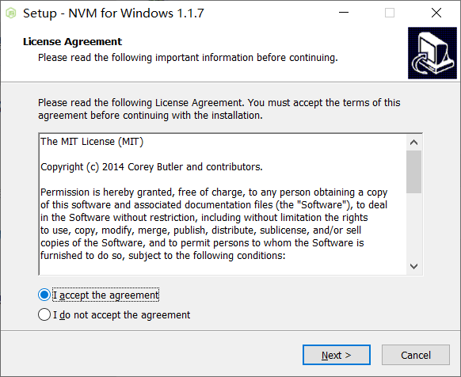

- 解压zip安装包，双击 **nvm-setup.exe** 安装文件，开始安装；
- 选择 `I accept the agreement` ，点击 `Next` 按钮。

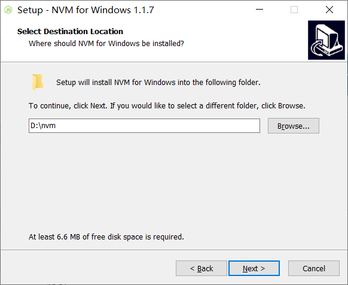

- 配置安装路径；**注意路径不要包含空格及中文** ，点击 `Next` 按钮。

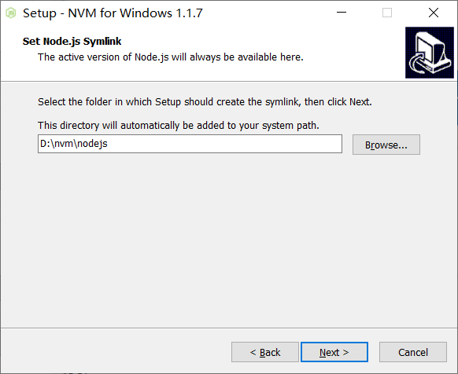

- 配置 node 的 symlink 文件夹位置，symlink 的作用同快捷方式；**注意路径不要包含空格及中文** ，点击 `Next` 按钮。

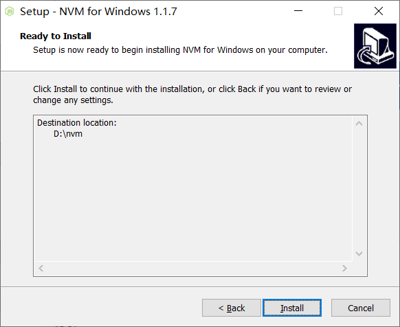

- 点击 `Install` 开始安装。

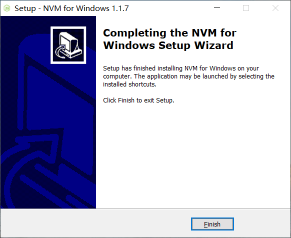

- 点击 `Finish` 完成安装。

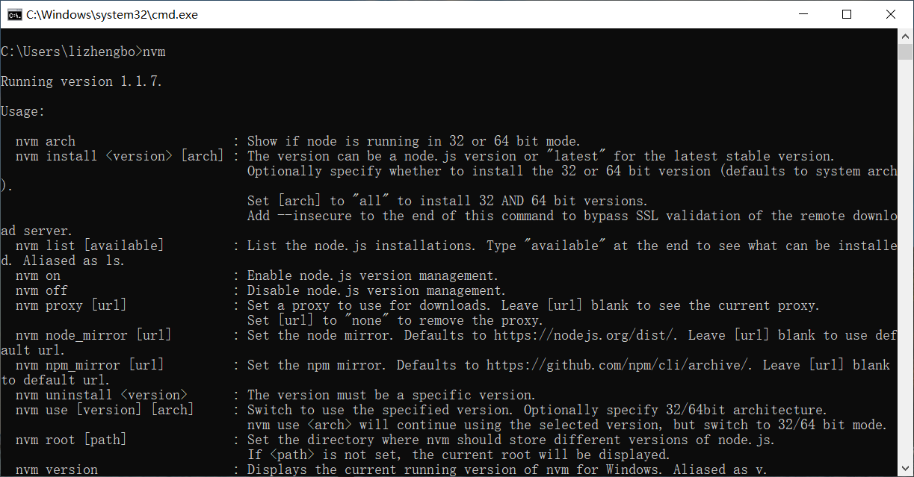

- 如上图所示，在 CMD 命令行窗口中执行 `nvm` 命令，显示结果如上所示，表示安装成功。


## 检查环境变量

> 最新版本的 NVM 会自动配置环境变量，这里只需检查环境变量是否已配置；若未配置再手动配置即可。

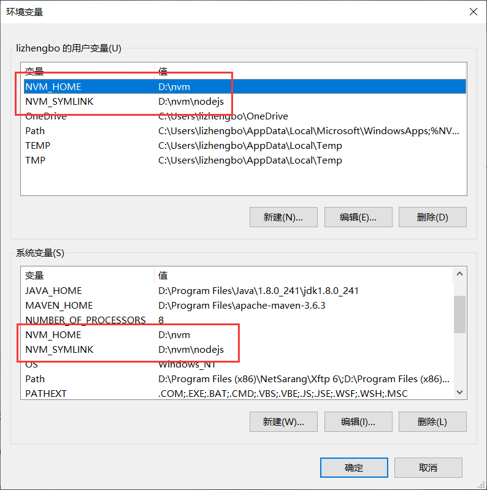

- 在用户变量和系统变量中均添加 `NVM_HOME` 和 `NVM_SYMLINK` 变量。
  - `NVM_HOME` 为 NVM 安装路径；
  - `NVM_SYMLINK` 为 node 的 symlink 路径。

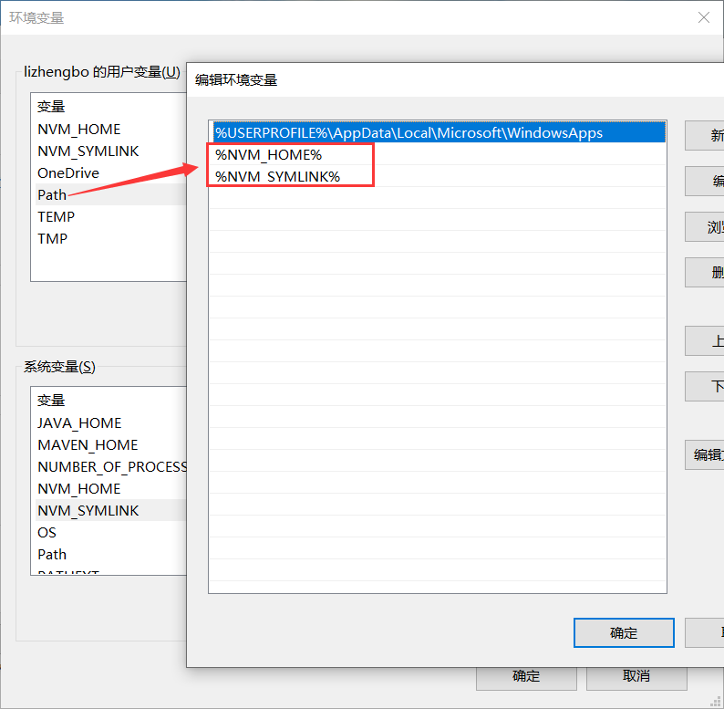

- 用户变量的 `Path` 中添加 `%NVM_HOME%` 和 `%NVM_SYMLINK%` 。

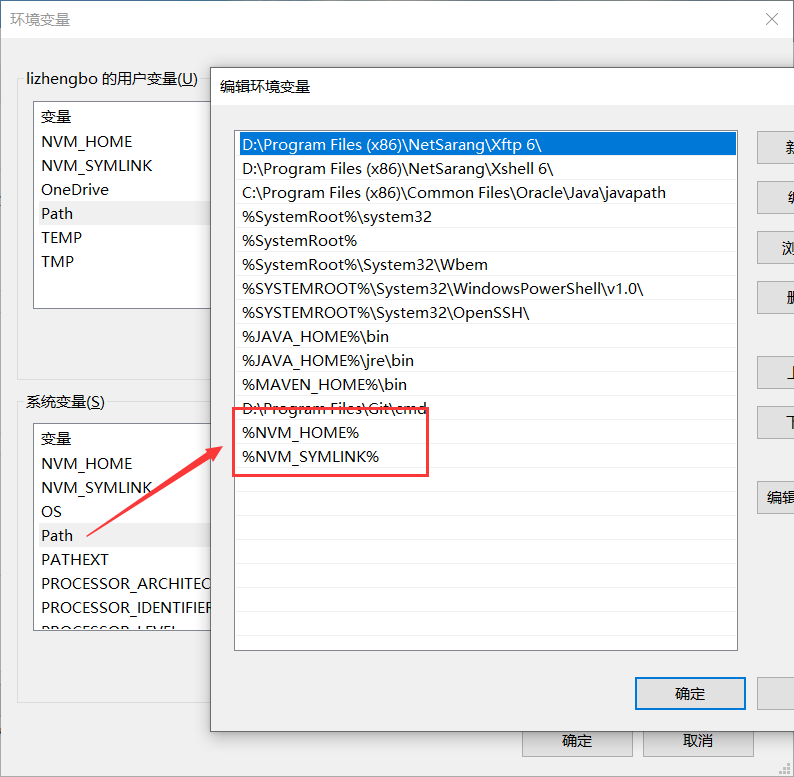

- 系统变量的 `Path` 中添加 `%NVM_HOME%` 和 `%NVM_SYMLINK%` 。


## 配置 Node 和 NPM 下载源

> 由于在国内连接国外的服务器会比较慢，为了加快下载速度，可以将下载源更换成淘宝镜像。

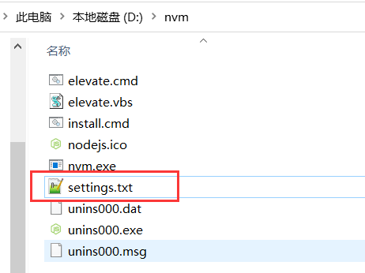

- 如上图所示，在 NVM 的安装目录下找到 `settings.txt` 文件，打开并编辑。

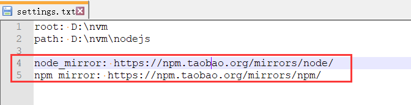

- 如上图所示，分别添加 node 和 npm 镜像地址，保存即可。

  ```properties
  #root为不同版本node的存储路径
  #path为node的symlink路径
  
  node_mirror: https://npm.taobao.org/mirrors/node/
  npm_mirror: https://npm.taobao.org/mirrors/npm/
  ```

- 对于默认的 npm 命令，可以使用 cnpm 命令行工具代替。cnpm 安装命令如下：

  ```bash
  npm install -g cnpm --registry=https://registry.npm.taobao.org
  ```


## 安装或管理 Node 版本

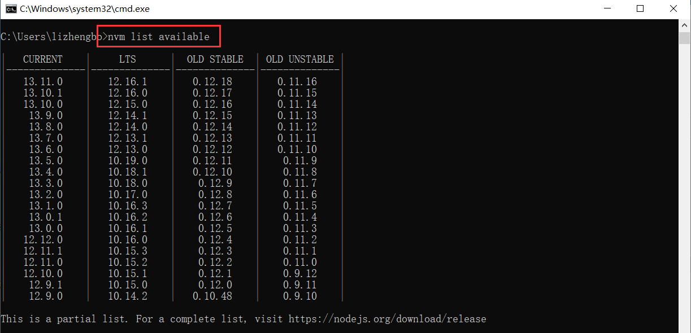

- `nvm list available` ：查看所有可安装的 node 版本；

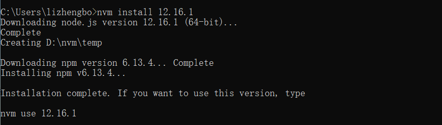

- `nvm install <version>` ：安装指定版本的 node ；

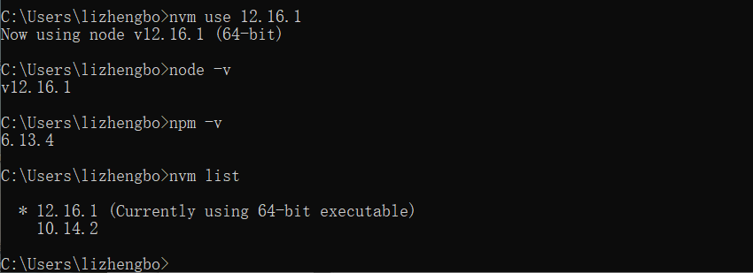

- `nvm use <version>` ：切换并使用指定版本的 node ；
- `node -v` ：查看当前使用的 node 版本；
- `npm -v` ：查看当前使用的 npm 版本；
- `nvm list` ：查看本地已安装的 node 版本，前面带 `*` 号的表示当前使用的 node 版本；

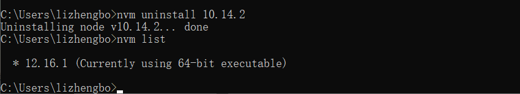

- `nvm uninstall <version>` ：卸载指定版本的 node ;


## NVM 命令

1. `nvm arch` ：显示node是运行在32位还是64位。
2. `nvm install <version> [arch]` ：安装node， version是特定版本也可以是最新稳定版本latest。可选参数 arch 指定安装32位还是64位版本，默认是系统位数。可以添加 --insecure 绕过远程服务器的SSL。
3. `nvm list [available]` ：显示已安装的列表。可选参数 available，显示可安装的所有版本。list 可简化为ls 。
4. `nvm on` ：开启 node 版本管理。
5. `nvm off` ：关闭 node 版本管理。
6. `nvm proxy [url]` ：设置下载代理。不加可选参数url，显示当前代理。将url设置为none则移除代理。
7. `nvm node_mirror [url]` ：设置 node 镜像。默认是 `https://nodejs.org/dist/` 。如果不写url，则使用默认url。设置后可至安装目录 settings.txt 文件查看，也可直接在该文件操作。
8. `nvm npm_mirror [url]` ：设置 npm 镜像。默认是 `https://github.com/npm/cli/archive/` 。如果不写url，则使用默认url。设置后可至安装目录 settings.txt 文件查看，也可直接在该文件操作。
9. `nvm uninstall <version>` ：卸载指定版本的 node。
10. `nvm use [version] [arch]` ：使用指定版本的 node。可指定32/64位。
11. `nvm root [path]` ：设置存储不同版本 node 的目录。如果未设置，默认使用当前目录。
12. `nvm version` ：显示 nvm 版本。version 可简化为 v 。


## 配置 Node 环境变量

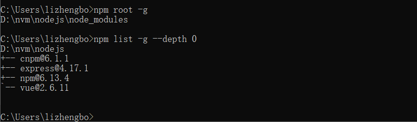

- `npm root -g` ：查看 npm 全局安装路径；
- `npm list -g --depth 0` ：查看全局安装包；`--depth 0` ： 限制输出模块层级；

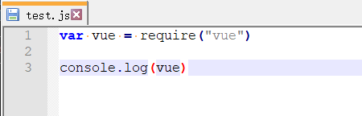

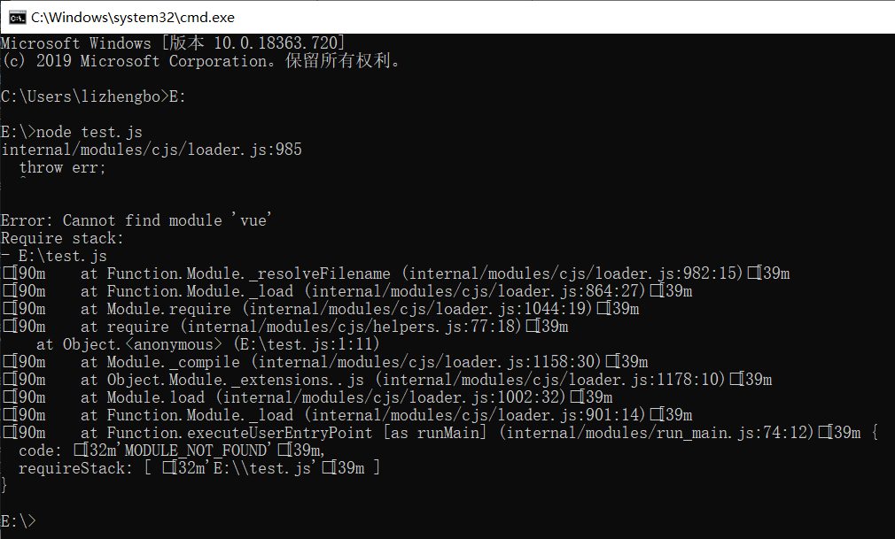

- 如上图1所示：写一个 js 文件文件，引入 vue 模块并输出，然后在 node 中执行该文件。
- 如上图2所示：执行报错，是由于 npm 全局安装路径还未配置到环境变量中。

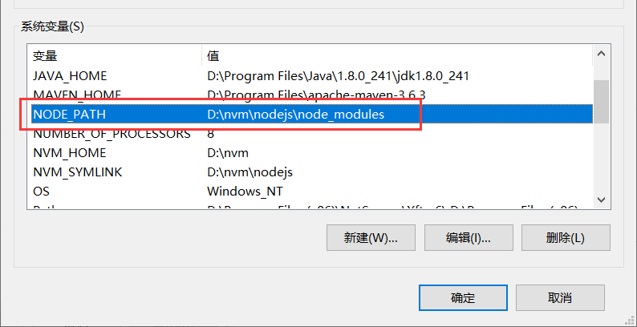

- 如上图所示，在系统变量中添加 `NODE_PATH` 变量，变量值为 `D:\nvm\nodejs\node_modules` 。

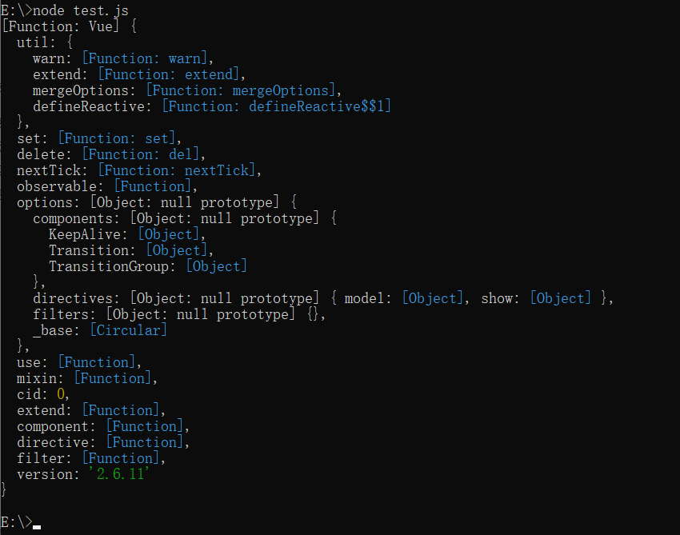

- 如上图所示，重新打开 CMD 窗口，再次执行 test.js 文件，输出正常。